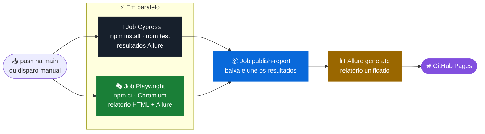
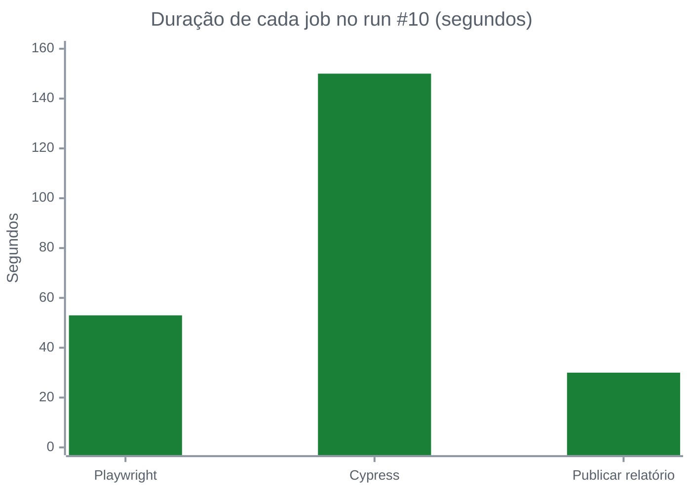
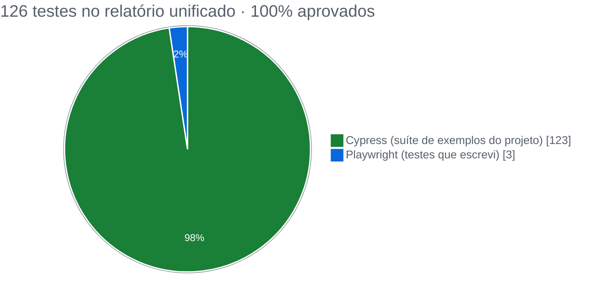
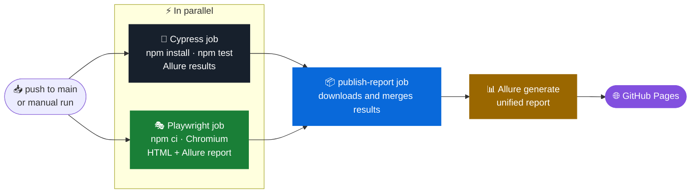

<div align="center">

# ⚙️ CI/CD com GitHub Actions · Cypress + Playwright + Allure

**Montei um pipeline que roda Cypress e Playwright em paralelo, unifica os resultados num relatório Allure e publica tudo no GitHub Pages a cada push**

[](https://github.com/gustavoanderson/ci-cd-github-actions/actions/workflows/node.js.yml)


📊 **[Ver o relatório Allure publicado ↗](https://gustavoanderson.github.io/ci-cd-github-actions/)**

🇧🇷 [Português](#-português) · 🇺🇸 [English](#-english)

</div>

---

## 🇧🇷 Português

### 🎯 Objetivo

Partindo de um projeto-base de aula da EBAC, o objetivo foi montar um **pipeline de integração contínua completo**. A ideia era que ninguém precisasse rodar teste na mão nem juntar relatório de ferramentas diferentes: a cada `push`, o GitHub executa tudo e publica o resultado num link público.

O desafio extra foi **fazer dois frameworks de teste conviverem no mesmo pipeline**, o Cypress e o Playwright, com um único relatório no final.

### 🧭 Estratégia

Organizei o workflow em **três jobs**. Os dois primeiros rodam em paralelo, e o terceiro só começa quando ambos terminam:



**Decisões que tomei no pipeline:**

| Decisão | Por quê |
|---|---|
| Jobs de Cypress e Playwright em paralelo | O tempo total fica próximo ao do job mais lento, e não à soma dos dois |
| `if: always()` no upload e na publicação | O relatório é publicado **mesmo quando algum teste falha**, justamente quando ele é mais necessário |
| Artefatos com `retention-days: 1` para resultados brutos | Os dados intermediários só servem para gerar o relatório, então não ocupam espaço à toa |
| `merge-multiple: true` no download | Junta os resultados das duas ferramentas numa pasta só, gerando **um relatório único** |
| Cache de `npm` no `setup-node` | Instalações mais rápidas a cada execução |
| Relatório HTML nativo do Playwright guardado por 30 dias | Permite investigar uma falha com trace, mesmo depois do run |

#### Mesmo teste, dois frameworks

Reescrevi em **Playwright** os testes do app de tarefas (*to-do*) que já existiam em Cypress, rodando lado a lado contra a mesma aplicação:

| Cenário | Cypress | Playwright |
|---|:-:|:-:|
| Exibe os dois itens padrão da lista | ✅ | ✅ |
| Adiciona um novo item | ✅ | ✅ |
| Marca um item como concluído | ✅ | ✅ |

No Playwright, configurei `retries: 2` no CI e `trace: on-first-retry`, que guarda o rastro completo da execução quando um teste precisa ser repetido.

### 📊 Resultados

Última execução do workflow completo ([run #10](https://github.com/gustavoanderson/ci-cd-github-actions/actions/runs/33889708676)), com os três jobs aprovados:



| Job | Resultado | Duração |
|---|:-:|:-:|
| 🎭 Playwright | ✅ success | 53 s |
| 🧪 Cypress | ✅ success | 150 s |
| 📦 Publicar relatório | ✅ success | 30 s |

O [relatório Allure publicado](https://gustavoanderson.github.io/ci-cd-github-actions/) consolida **126 testes, todos aprovados**, executados em 1 min 39 s:



| Relatório Allure | Valor |
|---|:-:|
| Testes executados | 126 |
| Aprovados | **126 (100%)** |
| Falhas | 0 |
| Tempo total | 1 min 39 s |

A suíte do Cypress executa os **123 testes de exemplo** do projeto (app de tarefas + exemplos avançados de comandos), e a suíte do Playwright executa os **3 testes que escrevi**.

#### 🐞 Problemas que resolvi no caminho

- **Versão do Node incompatível com o Playwright:** a primeira execução com os dois frameworks falhou. Ajustei a versão do Node no workflow e o pipeline voltou a passar em todos os jobs.
- **Arquivos pesados entrando no repositório:** um arquivo de download de 33 MB, gerado pelos testes, foi parar no commit. Removi e atualizei o `.gitignore` para ignorar downloads, screenshots e resultados gerados.
- **Indentação do YAML:** corrigi a indentação do step de testes no arquivo do workflow.

### 📈 O que o projeto entregou

- **126 testes rodando e passando automaticamente a cada push**, sem ninguém precisar executar nada na mão.
- **Dois frameworks, um relatório só:** Cypress e Playwright alimentam o mesmo Allure.
- **Relatório público e sempre atualizado** no GitHub Pages, acessível por qualquer pessoa do time com um link.
- **Pipeline resiliente:** o relatório sai mesmo quando algum teste falha.

### 🚀 Onde esse trabalho se aplica

- **Migração entre frameworks:** rodar Cypress e Playwright lado a lado permite migrar uma suíte aos poucos, comparando os resultados.
- **Portão de qualidade no pull request:** o mesmo workflow pode bloquear o merge quando algum teste falha.
- **Transparência para o time:** PO e gestão acompanham a qualidade pelo link do relatório, sem abrir o GitHub Actions.
- **Base para qualquer projeto de automação:** o esqueleto (instalar → testar → coletar → unificar → publicar) serve para API, mobile ou performance.

### ▶️ Como executar localmente

```bash
npm install
npm test                       # Cypress
npx playwright install chromium
npm run test:playwright        # Playwright
npm run report:generate        # gera o Allure unificado
npx allure open allure-report
```

---

## 🇺🇸 English

### 🎯 Goal

Starting from an EBAC course base project, I built a **full continuous integration pipeline**: on every `push`, GitHub runs all tests and publishes the result at a public link. The extra challenge was **running Cypress and Playwright in the same pipeline** with a single report at the end.

### 🧭 Strategy



Key decisions: parallel jobs (total time close to the slowest job), `if: always()` so the report is published **even when tests fail**, `merge-multiple: true` to produce **one unified report**, npm cache, and Playwright traces on retry. I also rewrote the Cypress to-do tests in **Playwright** to run side by side against the same app.

### 📊 Results

Latest full run ([run #10](https://github.com/gustavoanderson/ci-cd-github-actions/actions/runs/33889708676)), all three jobs passing:

| Job | Result | Duration |
|---|:-:|:-:|
| 🎭 Playwright | ✅ success | 53 s |
| 🧪 Cypress | ✅ success | 150 s |
| 📦 Publish report | ✅ success | 30 s |

The [published Allure report](https://gustavoanderson.github.io/ci-cd-github-actions/) consolidates **126 tests, all passing** (0 failures, 1 min 39 s): the project's **123 Cypress example tests** plus the **3 Playwright tests I wrote**.

**Problems I solved along the way:** a Node version incompatible with Playwright (fixed in the workflow), a 33 MB generated file committed by mistake (removed and added to `.gitignore`), and YAML indentation in the test step.

### 🚀 Where this applies

- **Migrating between frameworks** by running both side by side.
- **Quality gate on pull requests.**
- **Transparency:** anyone follows quality through the report link.
- **A reusable skeleton** (install → test → collect → merge → publish) for API, mobile or performance suites.

---

<div align="center">

Feito por **Gustavo Anderson** · QA Engineer
[](https://www.linkedin.com/in/gustavo-anderson)
[](https://github.com/gustavoanderson)

</div>
